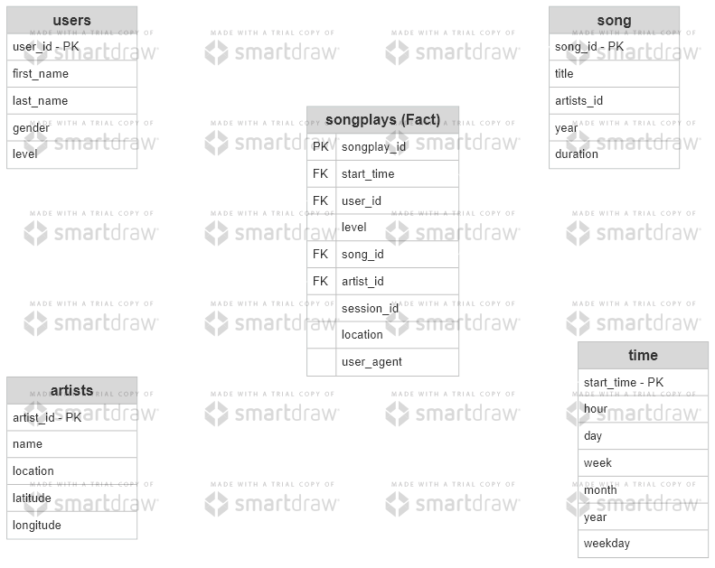

# Project: Data Warehouse
The project is a part of Udacity Data Engineering Nanodegree, details can be found here: https://www.udacity.com/course/data-engineer-nanodegree--nd027

A music streaming startup, Sparkify, has grown their user base and song database and want to move their processes and data onto the cloud. Their data resides in S3, in a directory of JSON logs on user activity on the app, as well as a directory with JSON metadata on the songs in their app.

The project aims to create an ETL pipeline that extracts the data from S3, stages them in Redshift, and transforms data into a set of dimensional tables. In detail, fact and dimiension tables for a star schema are defined for a particular analytic focus. The ETL pipeline that transfers data from files in two directories on cloud into these tables in Postgres was built using Python and SQL.

Keywords: PosgreSQL, S3, Redshift, Python.



### Project Structure

  * `create_cluster.ipynb` create Redshift cluster.

  * `create_tables.py` drops and creates your tables. You run this file to reset your tables before each time you run your ETL scripts.
  
  * `etl.py` -- A python script reads and processes files from the redshift database and loads the data into the tables.
  
  * `sql_queries.py` contains all sql queries, and is imported into the last three files above.
  
### Running the program
Step 1: Clone the project from repo
```bash
git clone git@github.com:phihd/data-warehouse.git
```
Step 2: Create Redshift cluster  
Run `create_cluster.ipynb`

Step 3: Run the program
```bash
cd data-modeling-posgreSQL
python create_tables.py
python etl.ipynb
```
